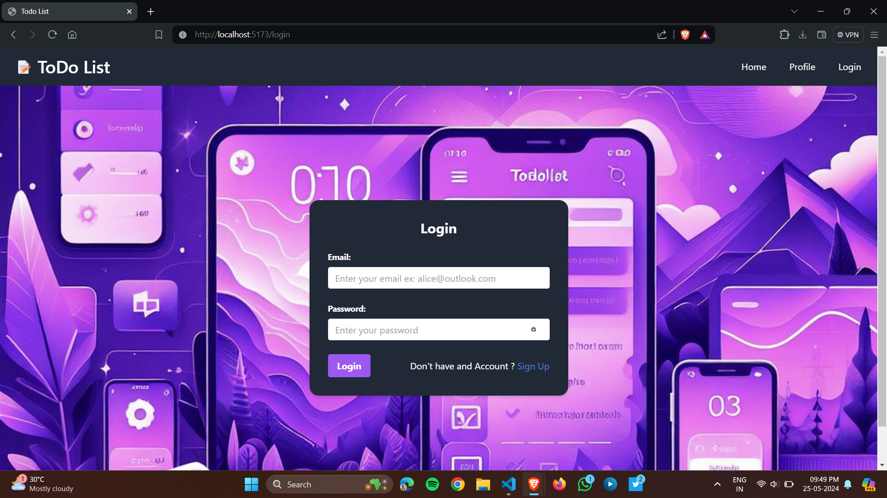

# Todolist-WebApp

#### Overview

Todolist-WebApp is a task management application that helps users organize and manage their tasks efficiently. It is designed with a modern, dark-themed user interface and provides functionalities like task creation, updating, and deletion, along with user authentication.

## Features

- **Task Management**: Create, update, and delete tasks with ease.
- **User Authentication**: Secure user login and registration with JWT (JSON Web Token).
- **Responsive Design**: Optimized for both mobile and desktop views.
- **Dark Theme**: Elegant and user-friendly dark-themed interface.

## Screenshots

Here are some screenshots of the application:

### Login Page


---


### Task Management


---


---

## Technologies Used

- **Frontend**: React, Vite, Tailwind CSS
- **Backend**: Node.js, Express, MongoDB
- **Authentication**: JWT (JSON Web Token)
- **Real-Time Updates**: Socket.IO (if applicable)
- **Hosting**: Vercel, Render

## Demo Credentials

For quick access and testing, you can use the following guest login credentials:

- **Email**: ram@gmail.com
- **Password**: ram

## Setup Instructions

### Prerequisites

- Node.js (>=14.x)
- npm

### Cloning Repository

```sh
git clone https://github.com/ravikirananaparthi/TodoList-WebApp.git
```

## Environment Variables

To run the application locally, you need to set up environment variables for both the frontend and backend.

#### Frontend Environment Variables

Create a `.env` file in the `client` directory with the following content:

```env
VITE_SERVER_VARIABLE=http://localhost:4000/api/v1
```

#### Backend Environment Variables

Create a `.env` file in the `server` directory with the following content:

```env
PORT=4000
MONGO_URI=your_mongo_db_connection_string
JWT_SECRET=your_jwt_secret
```

### Running the Application Locally

#### Frontend

1. **Navigate to the client directory**:
    ```sh
    cd client
    ```

2. **Install dependencies**:
    ```sh
    npm install
    ```

3. **Run the frontend development server**:
    ```sh
    npm run dev
    ```

#### Backend

1. **Navigate to the server directory**:
    ```sh
    cd ../server
    ```

2. **Install dependencies**:
    ```sh
    npm install
    ```

3. **Run the backend development server**:
    ```sh
    npm run dev
    ```

### Access the Application

Open your browser and navigate to `http://localhost:5173`.

---

This README file includes detailed instructions on setting up and running the Todolist-WebApp locally, including the necessary environment variables for both the frontend and backend.